# Diabetes and Hypertension in ELSA, OCTO, and RUSH

<!--  Set the working directory to the repository's base directory; this assumes the report is nested inside of only one directory.-->

<!-- Set the report-wide options, and point to the external script file. -->

 

# Observed Trajectories (sub sample)
- subsampe of random 300 individuals
- Semi-transparent circles represent measurement of persons
- Thin **grey lines** connect dots of one person
- **Solid line** is the main effect.  
- **Dashed line** is the effect of HTN, DM, and HTNDM.  

## ELSA  
 

## OCTO 
 

## RUSHc 
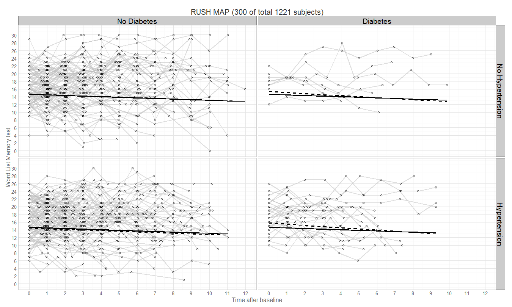 

## RUSHe 
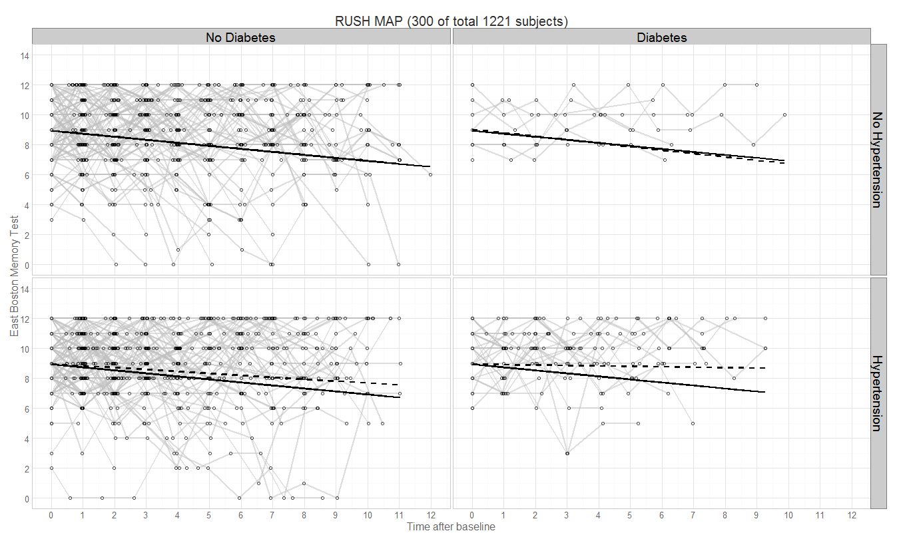 

## RUSHl 
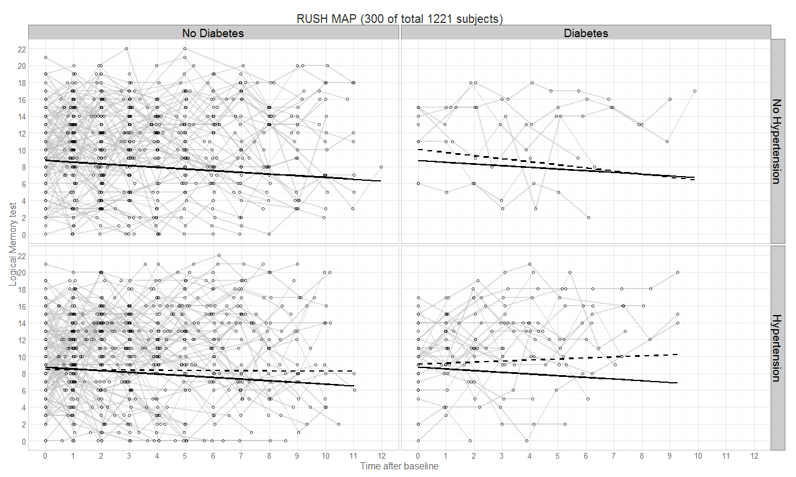 

# Observed Trajectories (full sample)
- full sample
- Semi-transparent circles represent measurement of persons
- Thin **grey lines** connect dots of one person
- **Solid line** is the main effect.  
- **Dashed line** is the effect of HTN, DM, and HTNDM.  

## ELSA  
 

## OCTO 
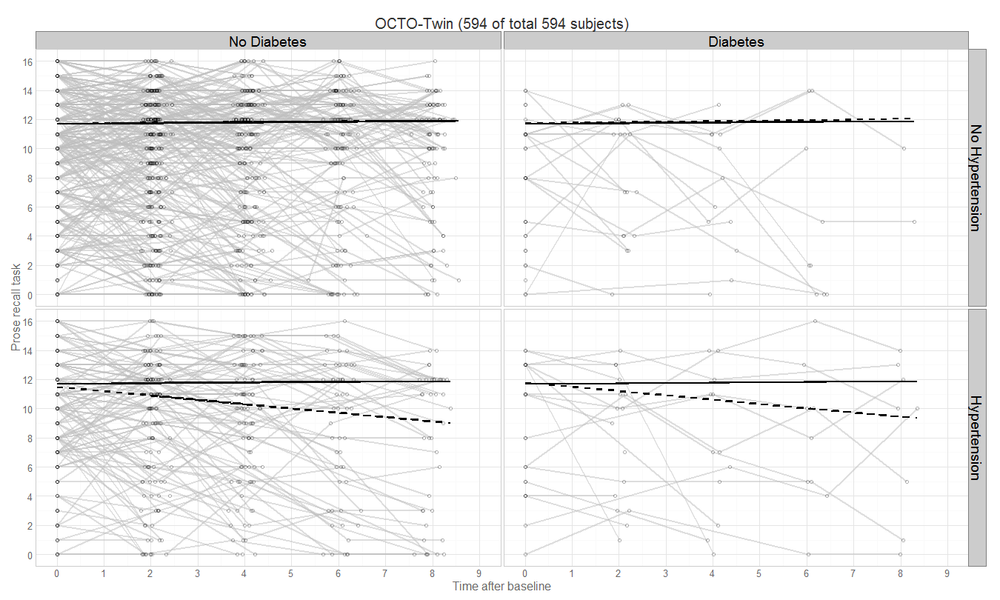 

## RUSHc 
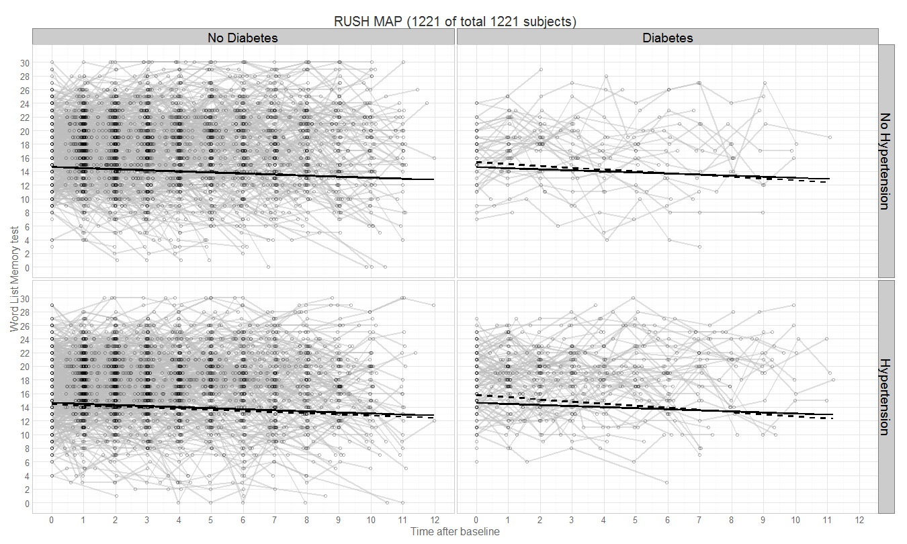 

## RUSHe 
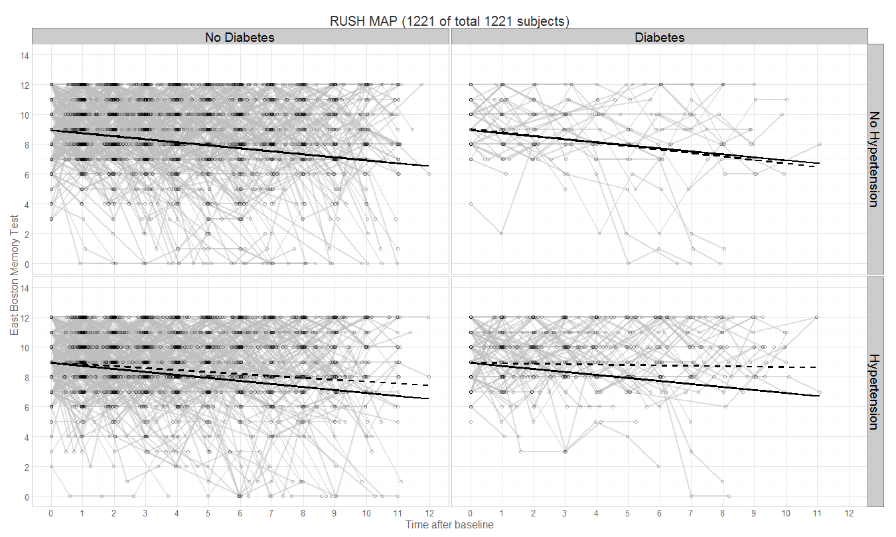 

## RUSHl 
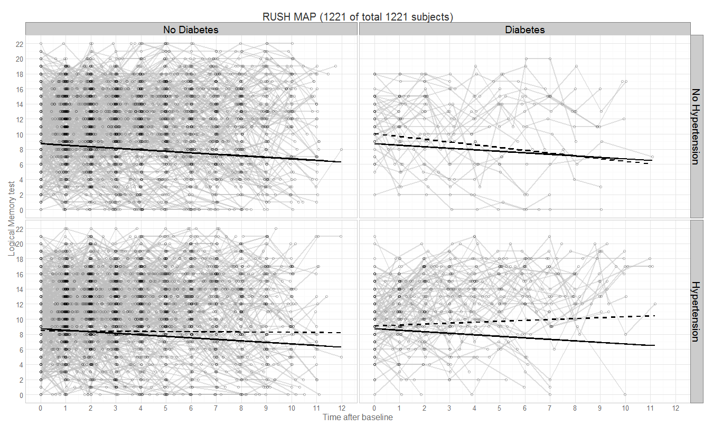 

# Effects & Trajectories

- Thin **grey lines** are individual trajectoried computed from factor scores (slopes and intercepts) estimated by MPlus.  
- **Solid line** is the main effect.  
- **Dashed line** is the effect of HTN, DM, and HTNDM.  

## ELSA  
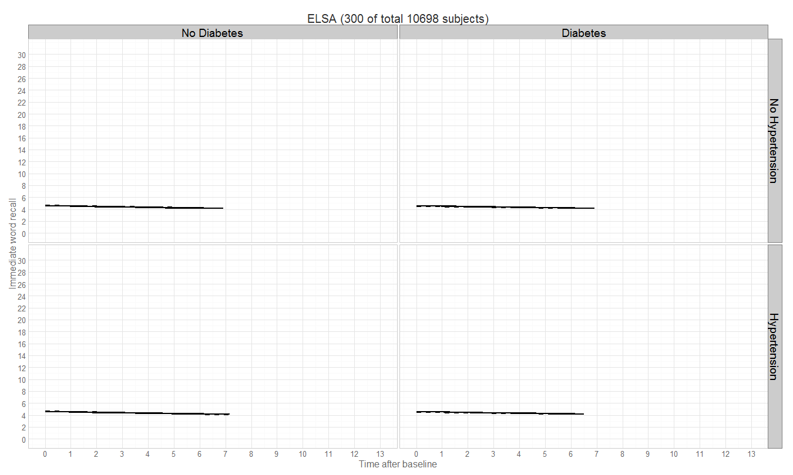 

## OCTO 
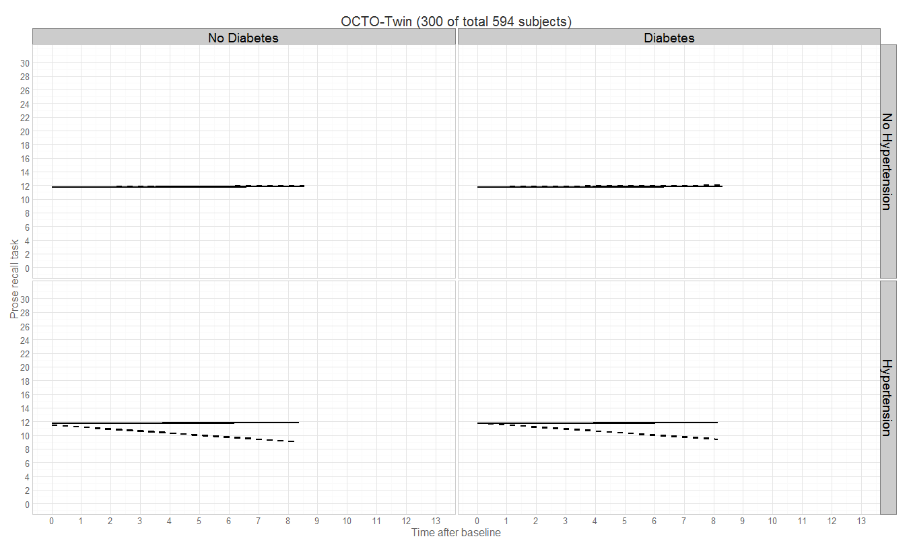 

## RUSHc 
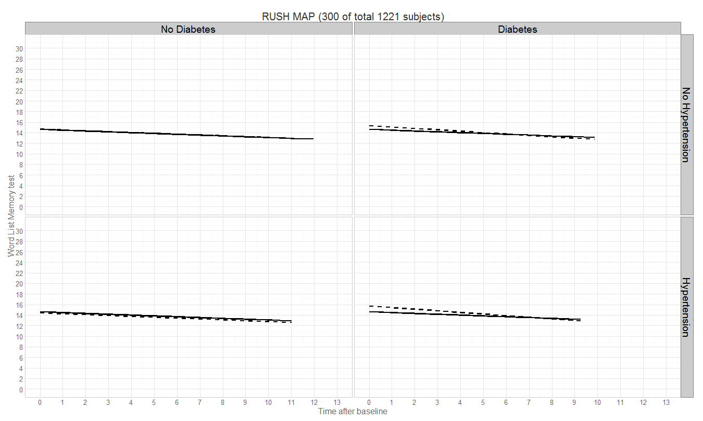 

## RUSHe 
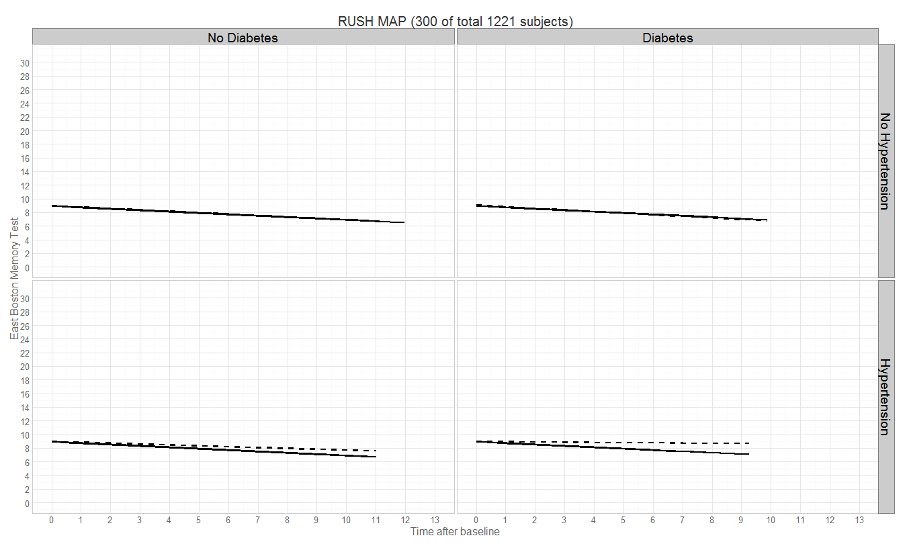 

## RUSHl 
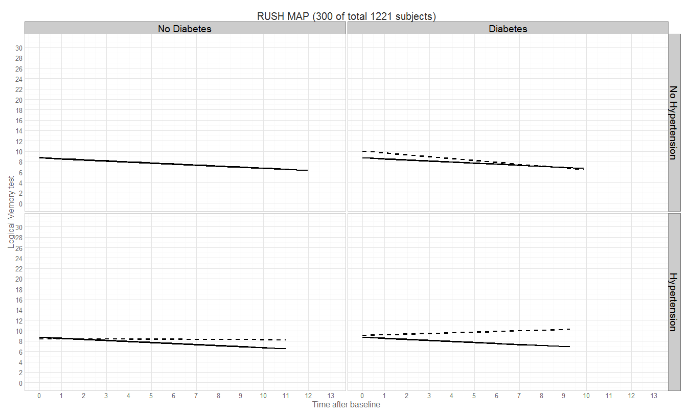 

# Scaled versions

## ELSA  
 

## OCTO 
 

## RUSHc 
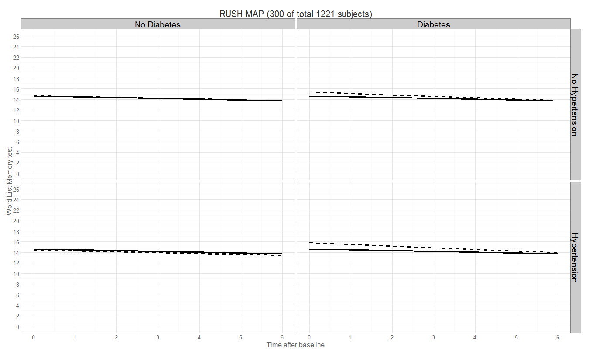 

## RUSHe 
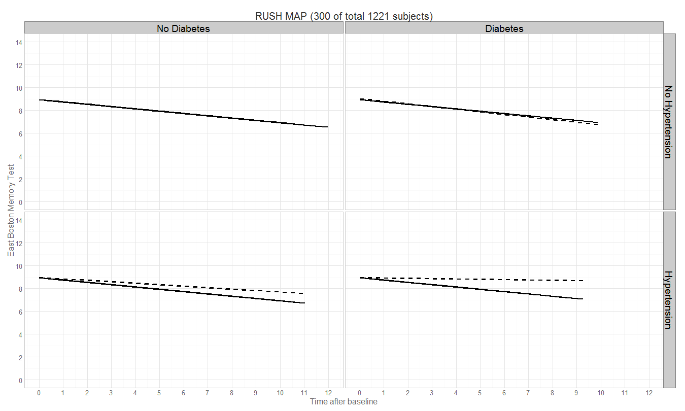 

## RUSHl 
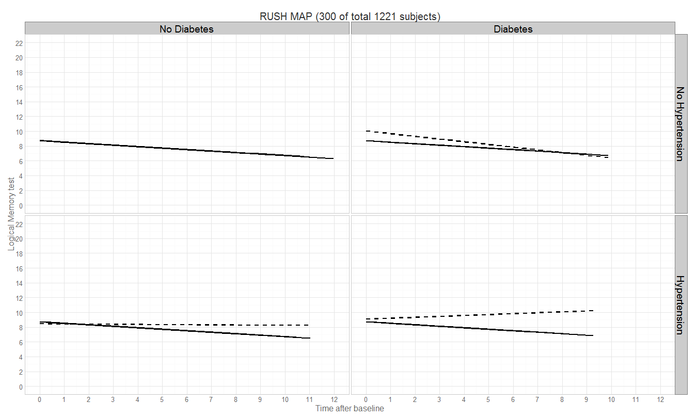 

# Residuals

## ELSA 
 

## OCTO 
 

## RUSHc 
 

## RUSHe 
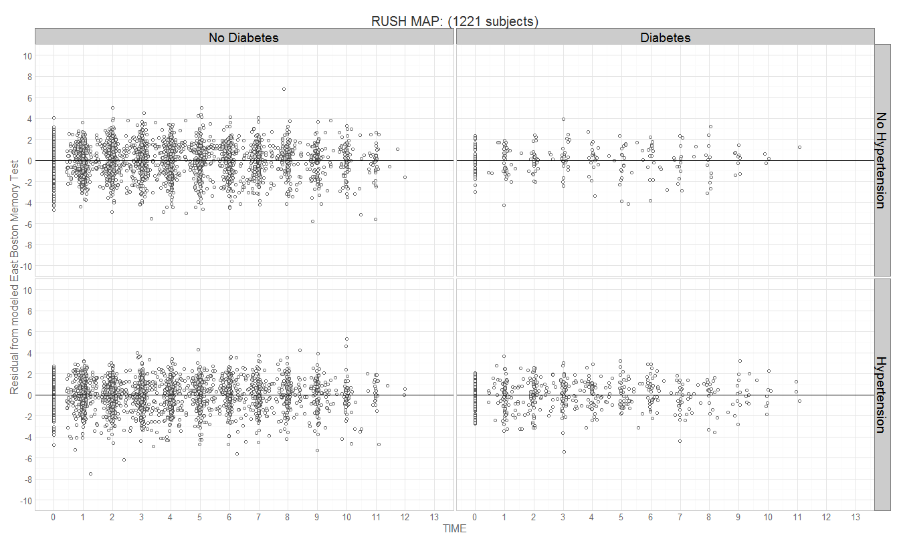 

## RUSHl 
 

                
              

