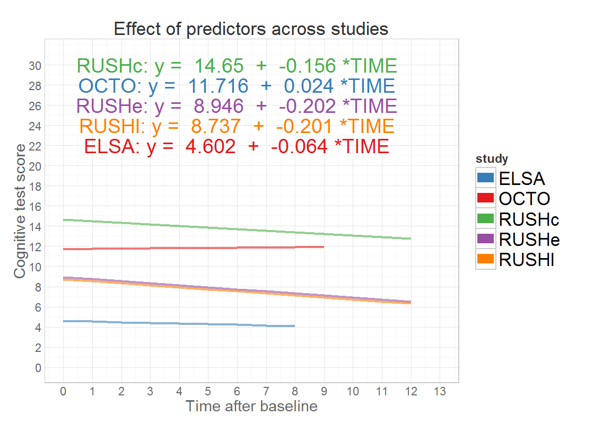
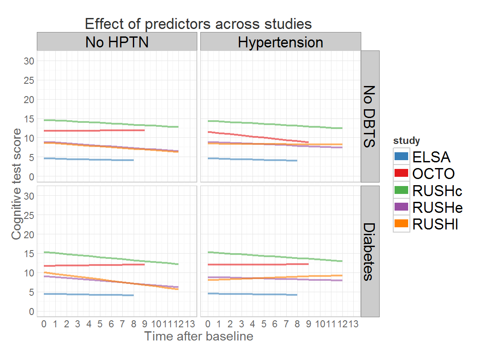
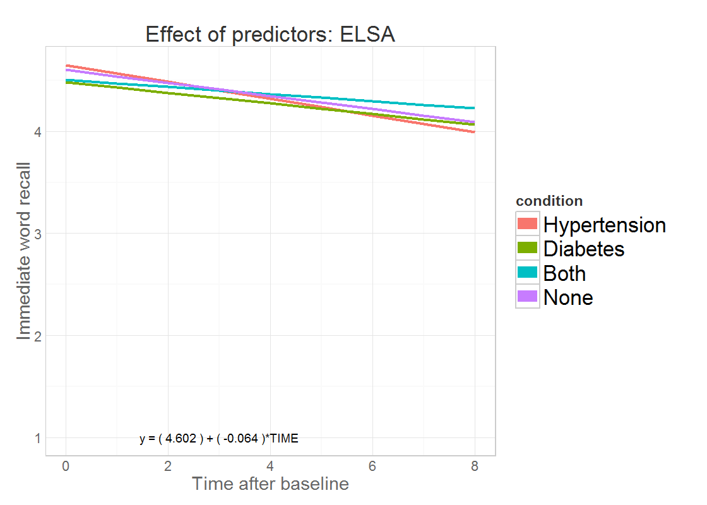
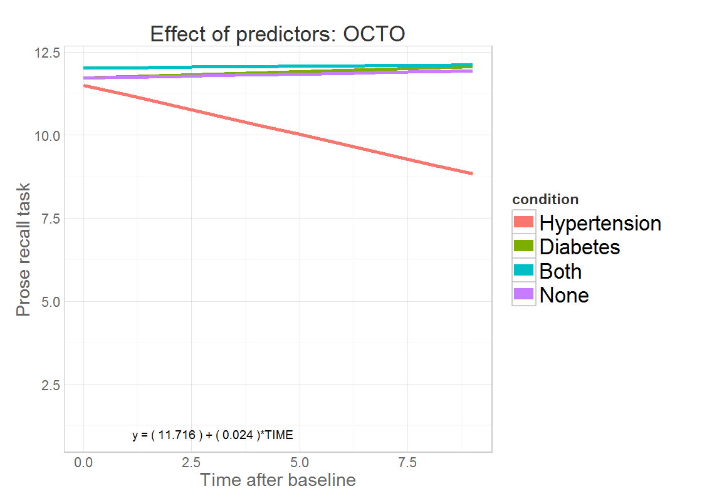
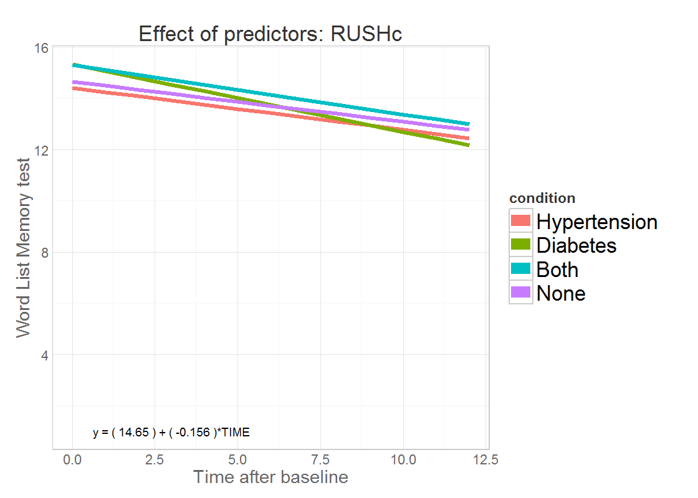
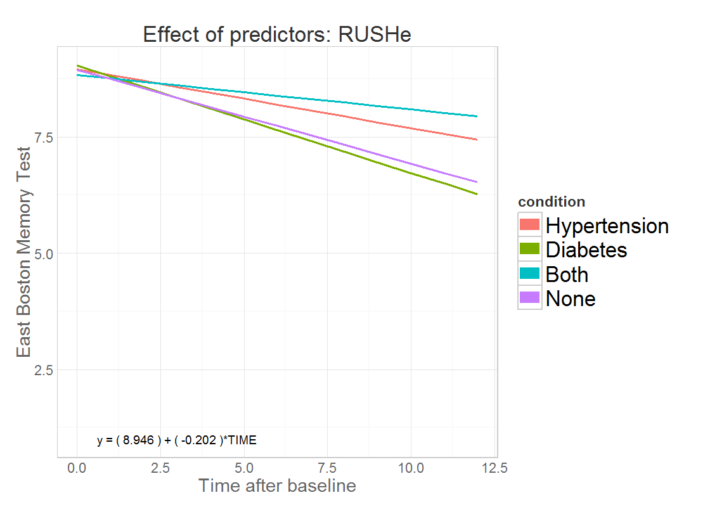
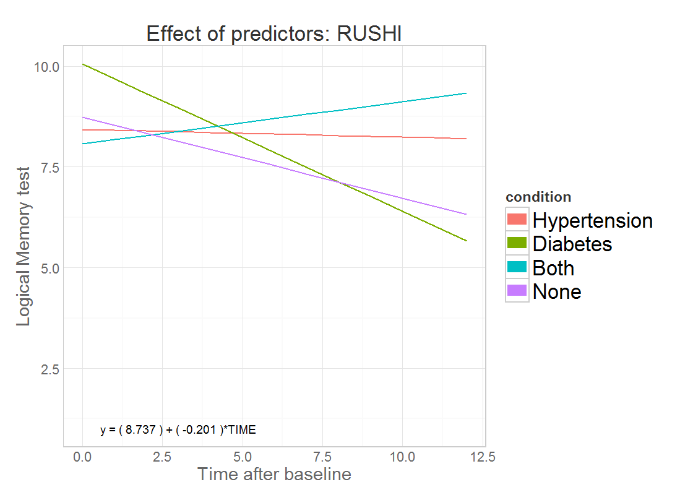

# Compare studies

<!--  Set the working directory to the repository's base directory; this assumes the report is nested inside of only one directory.-->

<!-- Set the report-wide options, and point to the external script file. -->

 

##   Compare main effects
 

## Effect of focal predictors
 

## ELSA: HTN & DM
 

## OCTO: HTN & DM
 

## RUSHc: HTN & DM
 

## RUSHe: HTN & DM
 

## RUSHl: HTN & DM
 

