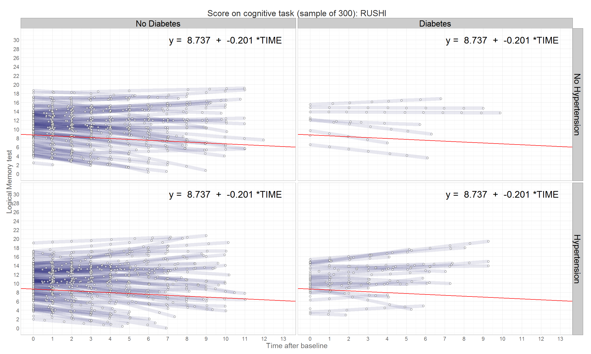

# Diabetes and Hypertension in ELSA, OCTO, and RUSH

<!--  Set the working directory to the repository's base directory; this assumes the report is nested inside of only one directory.-->

<!-- Set the report-wide options, and point to the external script file. -->

 

# Counts by Wave
Counts the number of datapoints in the criterion availibe at each time interval.

## by Wave : ELSA 

## by Wave : OCTO 

## by Wave : RUSHc 

## by Wave : RUSHe 

## by Wave : RUSHl 

# Counts by Age
Counts the number of datapoints in the criterion availibe at each time interval.

##   by Age : ELSA 

##   by Age : OCTO 

##   by Age : RUSHc 

##   by Age : RUSHe 

##   by Age : RUSHl 

# Observed Trajectories (Time)
Transparent blue lines represent observed trajectories. A random sample was selected from the study's data to avoid overplotting. Solid red line represents the fixed effects of the intercept and slope that are quantified in the equation in the top right corner. 

##   by Time : ELSA 
 

##   by Time  : OCTO 
 

##   by Time  : RUSHc 
 

##   by Time  : RUSHe 
 

##   by Time  : RUSHl 
 

# Observed Trajectories (Age)
The legend is the same as in the plot of observed trajectories. This is the same model (using TIME IN STUDY to predict the outcome), however in this graph the trajectories are re-distributed over a different metric of time: Age in years at the time of the interview.

##   by Age : ELSA 
 

##   by Age : OCTO 
 

##   by Age : RUSHc 
 

##   by Age : RUSHe 
 

##   by Age : RUSHl 
 

# Predicted Trajectories (Time) 
The legend is the same as in the plots above. Semi-transparent blue lines represent the model prediction for each individual, computed from the estimated unique slopes and variances.

##   by Time : ELSA 
 

##   by Time : OCTO 
 

##   by Time : RUSHc 
 

##  by Time : RUSHe 
 

##   by Time : RUSHl 
 

# Predicted Trajectories (Age) 

The legend is the same as in the plots above. Semi-transparent blue lines represent the model prediction for each individual, computed from the estimated unique slopes and variances.This is the same model as above, only the trajectories are re-distributed over a different metric of time: Age in years at the time of the interview.

##   by Age : ELSA 
 

##   by Age : OCTO 
 

##   by Age : RUSHc 
 

##   by Age : RUSHe 
 

##   by Age : RUSHl 
 

              

${y_{ti}} = {\beta _{0i}} + {\beta _{1i}}Tim{e_{ti}} + {\varepsilon _{ti}}\\
\\
{\beta _{0i}} = {\gamma _{0.0}} + {\gamma _{0.1}}SE{X_i} + {\gamma _{0.2}}AG{E_i} + {\gamma _{0.3}}E{D_i} + {\gamma _{0.4}}SMOKE{D_i} + {\gamma _{0.5}}CH{F_i} + {\gamma _{0.6}}M{I_i} + {\gamma _{0.7}}ST{K_i} + {\gamma _{0.7}}HP{N_i} + \\
 + {\gamma _{0.8}}D{M_i} + {\gamma _{0.9}}HTND{M_i} + {\gamma _{0.11}}AGE\_SE{X_i} + {\gamma _{0.12}}AGE\_HT{N_i} + {\gamma _{0.13}}AGE\_D{M_i} + {\gamma _{0.14}}SEX\_HT{N_i} + {\gamma _{0.15}}SEX\_D{M_i} + {u_{0i}}\\
\\
{\beta _{1i}} = {\gamma _{1.0}} + {\gamma _{1.1}}SE{X_i} + {\gamma _{1.2}}AG{E_i} + {\gamma _{1.3}}E{D_i} + {\gamma _{1.4}}SMOKE{D_i} + {\gamma _{1.5}}CH{F_i} + {\gamma _{1.6}}M{I_i} + {\gamma _{1.7}}ST{K_i} + {\gamma _{1.7}}HP{N_i} + \\
 + {\gamma _{1.8}}D{M_i} + {\gamma _{1.9}}HTND{M_i} + {\gamma _{1.11}}AGE\_SE{X_i} + {\gamma _{1.12}}AGE\_HT{N_i} + {\gamma _{1.13}}AGE\_D{M_i} + {\gamma _{1.14}}SEX\_HT{N_i} + {\gamma _{1.15}}SEX\_D{M_i} + {u_{1i}}\\$

  

