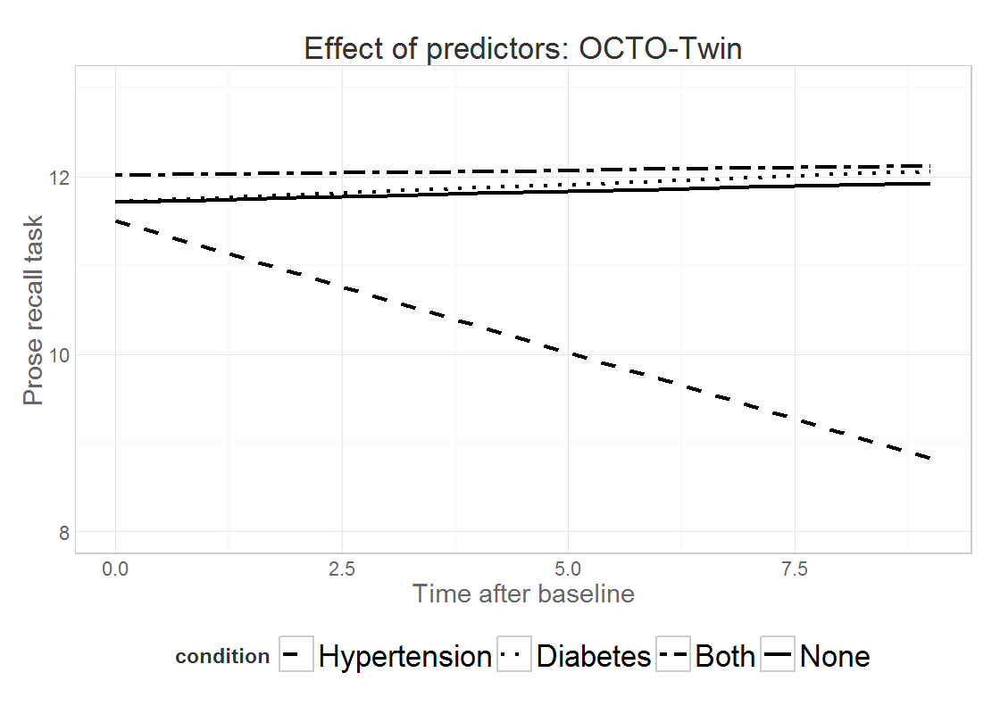
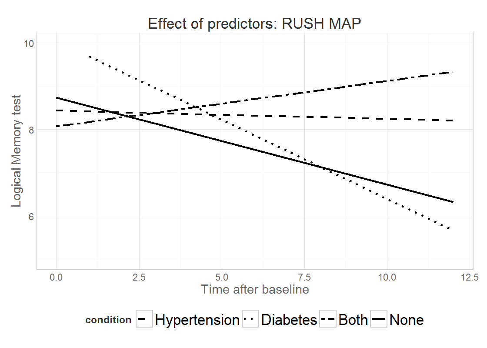

# Fig 1 & 2

<!--  Set the working directory to the repository's base directory; this assumes the report is nested inside of only one directory.-->

<!-- Set the report-wide options, and point to the external script file. -->

 

## OCTO: HTN & DM
 

## RUSHl: HTN & DM
 

